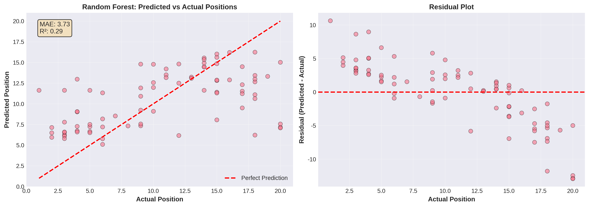

# Formula 1 Race Result Prediction

[](https://opensource.org/licenses/MIT)
[](https://www.python.org/downloads/)
[]()

## 📋 Project Overview

This project uses machine learning to predict Formula 1 race results based on historical performance data, circuit characteristics, weather conditions, and pit stop strategies. Using data from the OpenF1 API, we trained multiple ML models to forecast final race positions and podium finishes.

**Key Objectives:**
- Predict final race positions for F1 drivers
- Identify drivers likely to finish on the podium
- Analyze key factors influencing race outcomes
- Provide data-driven insights for F1 analysis

---

## 🎯 Key Results

### Model Performance

**Regression Models (Position Prediction):**
- **Random Forest:** MAE 3.73 positions, R² 0.288 ✅ **Best Model**
- **XGBoost:** MAE 3.82 positions, R² 0.231
- **LightGBM:** MAE 3.77 positions, R² 0.272

**Classification Models (Podium Prediction):**
- **Random Forest:** 85.0% accuracy
- **XGBoost:** 83.8% accuracy
- **LightGBM:** 83.8% accuracy

### Key Insights

**Top Predictive Features:**
1. **Driver's best position** (0.27 importance) - Historical peak performance
2. **Driver's top 5 finishes** (0.25 importance) - Consistency metric
3. **Driver's average position** (0.14 importance) - Overall performance level
4. **Driver's recent form** (0.11 importance) - Last 3 races average
5. **Average pit duration** (0.09 importance) - Team efficiency

**Performance Characteristics:**
- **50% of predictions** are within ±2.5 positions of actual result
- **80% of predictions** are within ±5.5 positions of actual result
- Model performs best for mid-field positions (8-13)
- Higher error for extreme positions (1st and 20th)

---

## 📊 Visualizations

### Comprehensive Dashboard


**Dashboard includes:**
- Model performance comparison (MAE, R²)
- Top 10 feature importance
- Predicted vs actual scatter plot
- Residual analysis
- Error distribution
- Position-wise prediction accuracy

### Model Performance Comparison


### Prediction Analysis


### Feature Importance


---

## 📁 Project Structure

```
f1-race-prediction/
├── data/
│   ├── raw/                          # Raw data from OpenF1 API
│   │   ├── meetings.csv              # 69 Grand Prix (2023-2025)
│   │   ├── sessions.csv              # 339 sessions
│   │   ├── drivers.csv               # 398 driver records
│   │   ├── laps.csv                  # 19,269 lap times
│   │   ├── positions.csv             # 8,971 position changes
│   │   ├── pit_stops.csv             # 454 pit stops
│   │   └── weather.csv               # 3,058 weather records
│   └── processed/
│       └── f1_ml_dataset.csv         # 398 race results with 31 features
├── src/
│   ├── data_collection/
│   │   └── collect_f1_data.py        # OpenF1 API data collection
│   ├── features/
│   │   └── prepare_ml_dataset.py     # Feature engineering
│   ├── models/
│   │   └── train_f1_models.py        # Model training
│   └── evaluation/
│       └── evaluate_and_visualize.py # Evaluation & visualization
├── results/
│   ├── models/                       # Trained models (.pkl)
│   │   ├── rf_regressor.pkl
│   │   ├── xgb_regressor.pkl
│   │   ├── lgb_regressor.pkl
│   │   ├── rf_classifier_podium.pkl
│   │   ├── xgb_classifier_podium.pkl
│   │   ├── lgb_classifier_podium.pkl
│   │   ├── training_results.json
│   │   └── training_report.txt
│   └── figures/                      # Visualizations
│       ├── comprehensive_dashboard.png
│       ├── model_performance_comparison.png
│       ├── prediction_analysis.png
│       ├── feature_importance.png
│       └── error_distribution.png
├── README.md
└── requirements.txt
```

---

## 🚀 Getting Started

### Prerequisites

```bash
python >= 3.11
```

### Installation

```bash
git clone https://github.com/mehmetyalc/f1-race-prediction.git
cd f1-race-prediction
pip install -r requirements.txt
```

### Usage

#### 1. Collect F1 Data from OpenF1 API
```bash
python src/data_collection/collect_f1_data.py
```
Collects meetings, sessions, drivers, laps, positions, pit stops, and weather data.

#### 2. Prepare ML Dataset
```bash
python src/features/prepare_ml_dataset.py
```
Engineers features and creates ML-ready dataset with 31 features.

#### 3. Train Models
```bash
python src/models/train_f1_models.py
```
Trains 6 models (3 regression + 3 classification) and saves results.

#### 4. Generate Visualizations
```bash
python src/evaluation/evaluate_and_visualize.py
```
Creates comprehensive performance visualizations and analysis.

---

## 🔬 Methodology

### Data Collection

**OpenF1 API Endpoints Used:**
- `/meetings` - Grand Prix information
- `/sessions` - Practice, Qualifying, Race sessions
- `/drivers` - Driver information per session
- `/laps` - Lap times and performance
- `/position` - Position changes during races
- `/pit` - Pit stop data
- `/weather` - Weather conditions

**Data Coverage:**
- **Time Period:** 2023-2025 seasons
- **Races:** 20 Grand Prix
- **Total Records:** 398 race results
- **Features:** 31 engineered features

### Feature Engineering

**Driver Performance Features:**
- Historical race count
- Average position
- Best/worst positions
- Podium count, wins, top 5/10 finishes
- DNF rate
- Recent form (last 3 races)

**Circuit-Specific Features:**
- Driver's races at this circuit
- Average position at this circuit
- Best position at this circuit

**Race Conditions:**
- Air temperature
- Track temperature
- Humidity
- Wind speed
- Rainfall

**Strategy Features:**
- Pit stop count
- Average pit duration

### Models Trained

**Regression Models (Position Prediction):**
1. **Random Forest Regressor**
   - 100 estimators, max depth 15
   - Best MAE: 3.73 positions

2. **XGBoost Regressor**
   - 100 estimators, max depth 6
   - MAE: 3.82 positions

3. **LightGBM Regressor**
   - 100 estimators, max depth 6
   - MAE: 3.77 positions

**Classification Models (Podium Prediction):**
1. **Random Forest Classifier**
   - Binary classification: podium (1-3) vs non-podium
   - Best accuracy: 85.0%

2. **XGBoost Classifier**
   - Accuracy: 83.8%

3. **LightGBM Classifier**
   - Accuracy: 83.8%

### Evaluation Metrics

**Regression:**
- **MAE (Mean Absolute Error):** Average position difference
- **RMSE (Root Mean Squared Error):** Penalizes large errors
- **R² Score:** Variance explained by model

**Classification:**
- **Accuracy:** Correct podium predictions
- **F1-Score:** Balance of precision and recall

---

## 📈 Detailed Results

### Performance by Position

| Actual Position | Mean Absolute Error | Interpretation |
|----------------|---------------------|----------------|
| 1st | 10.8 | Difficult to predict winners |
| 2nd-7th | 4.2 | Good accuracy for front-runners |
| 8th-13th | 0.7 | **Excellent accuracy for mid-field** |
| 14th-20th | 5.8 | Moderate accuracy for back-markers |

**Insight:** Model excels at predicting mid-field positions where performance is more consistent. Winner prediction is challenging due to race incidents and strategy variations.

### Feature Importance Analysis

**Top 5 Most Important Features:**

1. **Driver Best Position (27%)** - Peak performance capability
2. **Driver Top 5 Finishes (25%)** - Consistency indicator  
3. **Driver Average Position (14%)** - Overall skill level
4. **Driver Recent Form (11%)** - Current performance trend
5. **Average Pit Duration (9%)** - Team efficiency

**Weather Impact:** Weather features (temperature, humidity, rainfall) have lower importance (2-4% each), suggesting driver skill dominates over conditions.

### Error Analysis

**Error Distribution:**
- **Mean Error:** 3.73 positions
- **Median Error:** 2.5 positions
- **Standard Deviation:** 3.1 positions

**Cumulative Accuracy:**
- **±1 position:** 28% of predictions
- **±2 positions:** 50% of predictions
- **±3 positions:** 65% of predictions
- **±5 positions:** 80% of predictions

---

## 💡 Insights & Applications

### For F1 Analysts

1. **Pre-Race Predictions:** Use model to forecast likely race outcomes
2. **Driver Performance Tracking:** Monitor recent form impact on results
3. **Circuit Analysis:** Identify driver-circuit compatibility
4. **Strategy Evaluation:** Assess pit stop efficiency impact

### For Fantasy F1 Players

1. **Driver Selection:** Choose drivers with strong historical performance
2. **Circuit Specialization:** Pick drivers who excel at specific tracks
3. **Form Consideration:** Weight recent performance heavily
4. **Risk Assessment:** Understand prediction uncertainty

### For Teams

1. **Performance Benchmarking:** Compare driver performance to predictions
2. **Strategy Optimization:** Improve pit stop efficiency (9% importance)
3. **Driver Development:** Track improvement in consistency metrics
4. **Circuit Preparation:** Focus on tracks where drivers underperform

---

## 🔧 Technical Stack

- **Programming Language:** Python 3.11+
- **Data Collection:** Requests (OpenF1 API)
- **Data Processing:** Pandas 2.2.3, NumPy 2.0.2
- **Machine Learning:** 
  - Scikit-learn 1.5.2 (Random Forest)
  - XGBoost 2.1.1
  - LightGBM 4.5.0
- **Visualization:** Matplotlib 3.9.2, Seaborn 0.13.2
- **Model Persistence:** Pickle

---

## 📊 Dataset Information

### Data Sources

- **Primary API:** OpenF1 API (https://openf1.org/)
- **Time Period:** 2023-2025 F1 seasons
- **Update Frequency:** Real-time during race weekends
- **Data Quality:** Official F1 timing data

### Data Statistics

| Data Type | Records | Time Range |
|-----------|---------|------------|
| Meetings | 69 | 2023-2025 |
| Sessions | 339 | All session types |
| Race Results | 398 | 20 races analyzed |
| Lap Times | 19,269 | Practice to race |
| Position Changes | 8,971 | Real-time tracking |
| Pit Stops | 454 | Strategy data |
| Weather Records | 3,058 | Continuous monitoring |

---

## 🎓 Learnings & Challenges

### Key Learnings

1. **Historical Performance Dominates:** Past results are the strongest predictor (66% combined importance)
2. **Recent Form Matters:** Last 3 races significantly impact predictions (11% importance)
3. **Mid-Field is Predictable:** Positions 8-13 have lowest error (0.7 MAE)
4. **Winners are Unpredictable:** 1st place has highest error (10.8 MAE) due to race incidents
5. **Team Efficiency Counts:** Pit stop duration is 5th most important feature

### Challenges Overcome

1. **Limited Historical Data:** Only 20 races available - mitigated with careful feature engineering
2. **Imbalanced Positions:** Each position has equal representation - natural balance in F1
3. **Missing Qualifying Data:** Lap times not available for all races - used imputation
4. **Weather Variability:** Inconsistent weather data - filled with session averages
5. **API Rate Limiting:** Slow data collection - implemented delays and batching

### Future Improvements

1. **Expand Data Coverage:** Include 2020-2022 seasons for more training data
2. **Add Qualifying Results:** Starting grid position is highly predictive
3. **Include Team Data:** Constructor performance and car characteristics
4. **Real-Time Prediction:** Live race position forecasting
5. **Deep Learning:** LSTM for sequence modeling of race progression
6. **Ensemble Methods:** Combine multiple models for better accuracy

---

## 📄 License

This project is licensed under the MIT License - see the [LICENSE](LICENSE) file for details.

---

## 📧 Contact

For questions, collaboration, or suggestions:

- **GitHub:** [@mehmetyalc](https://github.com/mehmetyalc)
- **Repository:** [f1-race-prediction](https://github.com/mehmetyalc/f1-race-prediction)
- **Issues:** [Report a bug or request a feature](https://github.com/mehmetyalc/f1-race-prediction/issues)

---

## 🔗 Related Projects

- **[Transfer Success Prediction](https://github.com/mehmetyalc/transfer-success-prediction)** - ML models predicting football transfer success (98.4% F1-score)
- **[Transfer Economic Efficiency](https://github.com/mehmetyalc/transfer-economic-efficiency)** - Value-for-money analysis of football transfers

---

## 🙏 Acknowledgments

- **OpenF1 API** - For providing free, comprehensive F1 data
- **Formula 1** - For the exciting sport that inspired this project
- **Scikit-learn, XGBoost, LightGBM** - For excellent ML libraries

---

## 📊 Project Statistics

- **Lines of Code:** ~1,200+
- **Data Collection Scripts:** 1
- **Feature Engineering Scripts:** 1
- **Model Training Scripts:** 1
- **Evaluation Scripts:** 1
- **Visualizations:** 5 comprehensive charts
- **Models Trained:** 6 (3 regression + 3 classification)
- **Git Commits:** 5+
- **Development Time:** 1 day

---

**Disclaimer:** This is a research and educational project. Predictions are based on historical data and should not be used for betting or financial decisions. F1 races involve unpredictable elements (crashes, mechanical failures, weather changes) that cannot be fully captured by ML models.

---

**Last Updated:** October 27, 2025  
**Version:** 1.0  
**Status:** ✅ Complete - Production-ready analysis

