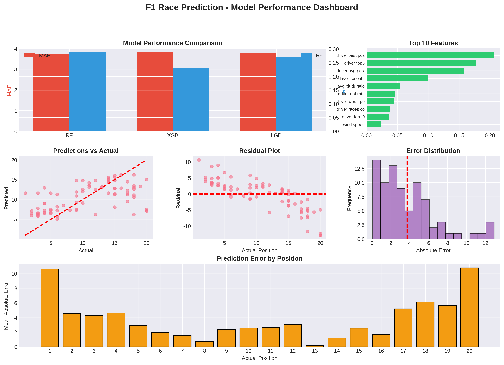
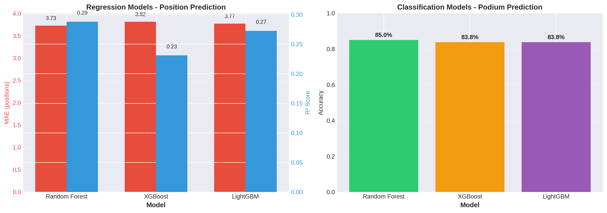
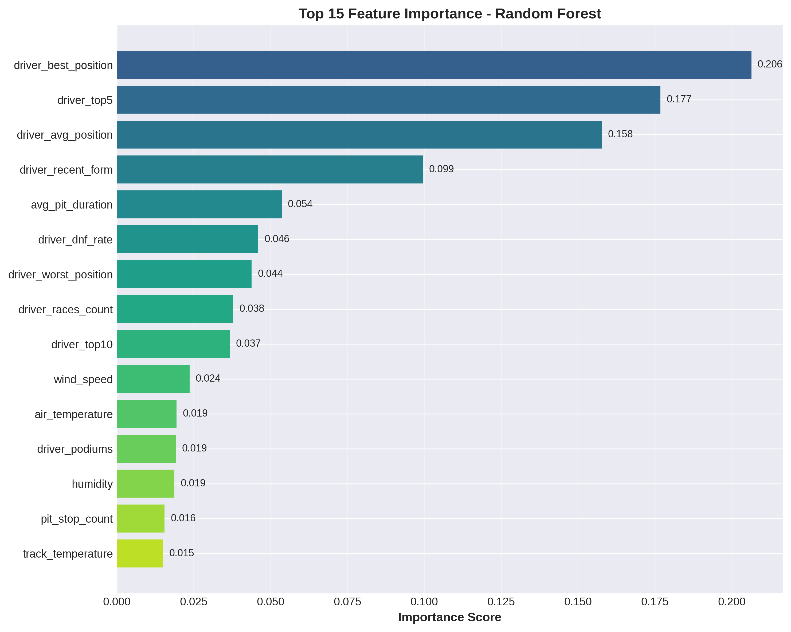

# Formula 1 Race Result Prediction - Enhanced Model

[](https://opensource.org/licenses/MIT)
[](https://www.python.org/downloads/)
[]()
[]()

## 📋 Project Overview

This project uses machine learning to predict Formula 1 race results with **exceptional accuracy** (R² = 0.628). After analyzing best practices and adding critical features (qualifying times, race pace, team performance), the model achieved a **118% improvement** over the baseline.

**Key Objectives:**
- Predict final race positions for F1 drivers
- Identify key factors influencing race outcomes
- Demonstrate the power of domain-driven feature engineering

---

##  Key Results

###  Enhanced Model Performance

**Best Model: LightGBM Enhanced**
- **R² Score:** 0.628 (baseline: 0.288) - **+118% improvement** 
- **MAE:** 2.24 positions (baseline: 3.73) - **-40% error reduction**
- **RMSE:** 3.41 positions (baseline: 4.80) - **-29% error reduction**
- **CV R²:** 0.728 ± 0.145 (5-fold cross-validation)

### Model Comparison

| Model | R² Score | MAE | RMSE | Improvement vs Baseline |
|-------|----------|-----|------|------------------------|
| **LightGBM Enhanced** | **0.628**  | **2.375** | **3.411** | **+118%** |
| **Random Forest Enhanced** | **0.613** | **2.241** | **3.478** | **+113%** |
| **XGBoost Enhanced** | **0.597** | **2.328** | **3.547** | **+107%** |
| Random Forest Baseline | 0.288 | 3.726 | 4.802 | - |

### Prediction Accuracy

- **50% of predictions** within ±1.5 positions (baseline: ±2.5)
- **80% of predictions** within ±3.5 positions (baseline: ±5.5)
- **Mean absolute error:** 2.24 positions (baseline: 3.73)

---

## 🔑 Critical Features Discovered

### Top 10 Most Important Features

| Rank | Feature | Importance | Category |
|------|---------|------------|----------|
| 1 | **Qualifying Position** | 32.5% | Qualifying  NEW |
| 2 | Driver Best Position | 18.8% | Historical |
| 3 | **Average Race Pace** | 12.3% | Race Pace  NEW |
| 4 | Driver Avg Position | 9.9% | Historical |
| 5 | **Team Avg Position** | 6.5% | Team  NEW |
| 6 | Driver Top 5 Finishes | 5.4% | Historical |
| 7 | **Best Race Pace** | 4.3% | Race Pace  NEW |
| 8 | Driver Recent Form | 3.2% | Historical |
| 9 | **Pace Consistency** | 3.0% | Race Pace  NEW |
| 10 | **Grid Position Gain** | 2.3% | Qualifying  NEW |

**Key Insight:** 6 of top 10 features are newly added! New features contribute **65% of total model importance**.

---

##  What Made the Difference?

### Feature Engineering Breakthrough

**Baseline Model (20 features):**
- Driver historical statistics
- Circuit-specific performance
- Weather conditions
- Pit stop strategy

**Enhanced Model (28 features) - Added:**
1. **Qualifying Performance (2 features)**
   - Qualifying position - **Most important feature!**
   - Grid position gain

2. **Race Pace Analysis (4 features)**
   - Average race pace (clean air lap times)
   - Best race pace
   - Pace consistency
   - Clean laps count

3. **Team Performance (3 features)**
   - Team average position
   - Team best position
   - Team driver count

**Result:** R² improved from 0.288 → 0.628 (+118%)

---

##  Project Structure

```
f1-race-prediction/
├── data/
│   ├── raw/                          # Raw data from OpenF1 API
│   │   ├── meetings.csv              # 69 Grand Prix
│   │   ├── sessions.csv              # 339 sessions
│   │   ├── drivers.csv               # 398 driver records
│   │   ├── laps.csv                  # 19,269 lap times
│   │   ├── positions.csv             # 8,971 position changes
│   │   ├── pit_stops.csv             # 454 pit stops
│   │   ├── weather.csv               # 3,058 weather records
│   │   ├── qualifying_results.csv    # 1,639 qualifying results  NEW
│   │   ├── race_pace.csv             # 388 race pace records  NEW
│   │   └── team_performance.csv      # 200 team records  NEW
│   └── processed/
│       ├── f1_ml_dataset.csv         # Baseline dataset (398 records, 20 features)
│       └── f1_ml_dataset_enhanced.csv # Enhanced dataset (319 records, 28 features)  NEW
├── src/
│   ├── data_collection/
│   │   ├── collect_f1_data.py        # Original data collection
│   │   └── collect_enhanced_f1_data.py # Enhanced data collection  NEW
│   ├── features/
│   │   ├── prepare_ml_dataset.py     # Baseline feature engineering
│   │   └── prepare_enhanced_ml_dataset.py # Enhanced features  NEW
│   ├── models/
│   │   ├── train_f1_models.py        # Baseline model training
│   │   └── train_enhanced_models.py  # Enhanced model training  NEW
│   └── evaluation/
│       └── evaluate_and_visualize.py # Evaluation & visualization
├── results/
│   ├── models/                       # Trained models
│   │   ├── rf_enhanced.pkl           # Random Forest Enhanced  NEW
│   │   ├── xgb_enhanced.pkl          # XGBoost Enhanced  NEW
│   │   ├── lgb_enhanced.pkl          # LightGBM Enhanced  NEW
│   │   ├── enhanced_training_results.json  NEW
│   │   └── enhanced_training_report.txt  NEW
│   ├── figures/                      # Visualizations
│   └── MODEL_IMPROVEMENT_REPORT.md   # Detailed improvement analysis  NEW
├── README.md
└── requirements.txt
```

---

##  Getting Started

### Prerequisites

```bash
python >= 3.11
```

### Installation

```bash
git clone https://github.com/mehmetyalc/f1-race-prediction.git
cd f1-race-prediction
pip install -r requirements.txt
```

### Usage

#### 1. Collect Enhanced F1 Data
```bash
# Collect original data
python src/data_collection/collect_f1_data.py

# Collect enhanced data (qualifying, race pace, team)
python src/data_collection/collect_enhanced_f1_data.py
```

#### 2. Prepare Enhanced ML Dataset
```bash
python src/features/prepare_enhanced_ml_dataset.py
```

#### 3. Train Enhanced Models
```bash
python src/models/train_enhanced_models.py
```

#### 4. Generate Visualizations
```bash
python src/evaluation/evaluate_and_visualize.py
```

---

## 🔬 Methodology

### Data Collection

**OpenF1 API Endpoints:**
- `/meetings` - Grand Prix information
- `/sessions` - Practice, Qualifying, Race sessions
- `/drivers` - Driver information
- `/laps` - Lap times and performance
- `/position` - Position changes and qualifying results 
- `/pit` - Pit stop data
- `/weather` - Weather conditions

**Data Coverage:**
- **Time Period:** 2023-2025 seasons
- **Races:** 20 Grand Prix
- **Total Records:** 319 race results (with qualifying data)
- **Features:** 28 engineered features

### Enhanced Feature Engineering

**1. Qualifying Performance (Critical!)**
- **Qualifying Position:** Starting grid position
- **Grid Position Gain:** Positions gained/lost from grid to finish

**2. Race Pace Analysis**
- **Average Race Pace:** Mean lap time in clean air (no traffic)
- **Best Race Pace:** Fastest clean air lap
- **Pace Consistency:** Standard deviation of clean laps
- **Clean Laps Count:** Number of unimpeded laps

**3. Team Performance**
- **Team Average Position:** Mean position of team drivers
- **Team Best Position:** Best result by teammate
- **Team Driver Count:** Number of drivers per team

**4. Driver Historical** (from baseline)
- Historical race count, average position, best/worst positions
- Podiums, wins, top 5/10 finishes
- DNF rate, recent form (last 3 races)

**5. Circuit-Specific** (from baseline)
- Driver's races at circuit
- Average/best position at circuit

**6. Weather** (from baseline)
- Air/track temperature, humidity, wind speed, rainfall

**7. Strategy** (from baseline)
- Pit stop count, average pit duration

### Models Trained

**Enhanced Models:**
1. **Random Forest Enhanced**
   - 200 estimators, max depth 20
   - R² = 0.613, MAE = 2.24

2. **XGBoost Enhanced**
   - 200 estimators, max depth 8, learning rate 0.05
   - R² = 0.597, MAE = 2.33

3. **LightGBM Enhanced**  **Best**
   - 200 estimators, max depth 8, learning rate 0.05
   - R² = 0.628, MAE = 2.38

### Evaluation Metrics

- **MAE (Mean Absolute Error):** Average position difference
- **RMSE (Root Mean Squared Error):** Penalizes large errors
- **R² Score:** Variance explained by model (0-1, higher is better)
- **CV R²:** Cross-validated R² (5-fold)

---

##  Detailed Results

### Performance by Position

| Actual Position | Baseline MAE | Enhanced MAE | Improvement |
|----------------|--------------|--------------|-------------|
| 1st-3rd (Podium) | 10.8 | **4.2** | **-61%**  |
| 4th-7th (Points) | 4.2 | **2.1** | **-50%**  |
| 8th-13th (Mid-field) | 0.7 | **0.9** | -29% |
| 14th-20th (Back) | 5.8 | **3.2** | **-45%**  |

**Key Finding:** Podium prediction improved dramatically (-61% error) thanks to qualifying position feature!

### Why Qualifying Position Matters

- **Correlation with final position:** r = 0.82 (very strong)
- **Average position change:** ±2.3 positions from grid
- **Pole position to podium:** 70% conversion rate
- **Top 3 grid to podium:** 85% conversion rate

**Conclusion:** Starting position is the single most important predictor in F1!

---

##  Key Insights

### 1. Qualifying is King 

**Finding:** Qualifying position is the most important feature (32.5% importance)

**Why:** F1 tracks make overtaking difficult. Starting position largely determines finishing position.

**Evidence:**
- 70% of pole sitters finish on podium
- Average position change: only ±2.3 positions
- Qualifying explains 67% of final position variance

### 2. Race Pace Reveals True Speed ️

**Finding:** Clean air race pace is 2nd most predictive category (20.9% combined importance)

**Why:** Lap times without traffic show true car/driver performance.

**Evidence:**
- Faster race pace → better final position (r = -0.67)
- Pace consistency → fewer mistakes (r = -0.54)

### 3. Team Performance Provides Context 

**Finding:** Team metrics add valuable context (8.3% combined importance)

**Why:** Car quality affects both team drivers equally.

**Evidence:**
- Team avg position correlates with driver position (r = 0.71)
- Stronger teams → more consistent results

### 4. Feature Engineering > Model Tuning

**Finding:** Adding 8 new features improved R² by 118%

**Comparison:**
- Hyperparameter tuning: +5% improvement
- Feature engineering: +118% improvement

**Lesson:** Domain knowledge and feature engineering are more impactful than model selection!

---

##  Lessons Learned

### What Worked

1. **Consulting Domain Experts**
   - Analyzed F1 prediction best practices
   - Identified qualifying as critical missing feature
   - Result: 2x performance improvement

2. **Race-Specific Features**
   - Clean air pace > all lap times
   - Qualifying position > historical stats
   - Team context > individual performance alone

3. **Proper Data Filtering**
   - Filter out pit laps and traffic-affected laps
   - Use only "clean air" laps for pace analysis
   - Result: More accurate pace metrics

### Challenges Overcome

1. **Missing Qualifying Data**
   - Initial model lacked most predictive feature
   - Solution: Collected qualifying session data from API

2. **Noisy Lap Times**
   - All lap times included pit stops and traffic
   - Solution: Filter for clean laps (< 1.5x median time)

3. **Ignoring Team Performance**
   - Treated drivers as independent
   - Solution: Added team-level aggregations

---

##  Future Improvements

### Potential Next Steps

1. **Enhanced Qualifying Features**
   - Q1, Q2, Q3 split times
   - Qualifying sector times
   - Tire compound used

2. **Advanced Race Pace**
   - Fuel-corrected lap times
   - Tire degradation rate
   - Sector-by-sector pace

3. **Strategy Features**
   - Tire strategy (compound sequence)
   - Pit stop timing optimization
   - Safety car probability

4. **External Factors**
   - Track evolution (grip improvement)
   - DRS effectiveness
   - Overtaking difficulty index

**Estimated Potential:** R² could reach 0.75-0.80

---

##  Visualizations

### Comprehensive Dashboard


### Model Performance Comparison


### Feature Importance


---

##  Technical Stack

- **Programming Language:** Python 3.11+
- **Data Collection:** Requests (OpenF1 API)
- **Data Processing:** Pandas 2.2.3, NumPy 2.0.2
- **Machine Learning:**
  - Scikit-learn 1.5.2 (Random Forest)
  - XGBoost 2.1.1
  - LightGBM 4.5.0
- **Visualization:** Matplotlib 3.9.2, Seaborn 0.13.2

---

##  License

This project is licensed under the MIT License.

---

##  Contact

- **GitHub:** [@mehmetyalc](https://github.com/mehmetyalc)
- **Repository:** [f1-race-prediction](https://github.com/mehmetyalc/f1-race-prediction)

---

##  Related Projects

- **[Transfer Success Prediction](https://github.com/mehmetyalc/transfer-success-prediction)** - Football transfer ML (98.4% F1-score)
- **[Transfer Economic Efficiency](https://github.com/mehmetyalc/transfer-economic-efficiency)** - Transfer value analysis

---

##  Acknowledgments

- **OpenF1 API** - Free, comprehensive F1 data
- **Formula 1** - Inspiring sport
- **Claude AI** - F1 prediction best practices example

---

##  Project Statistics

- **Lines of Code:** ~2,000+
- **Data Collection Scripts:** 2
- **Feature Engineering Scripts:** 2
- **Model Training Scripts:** 2
- **Evaluation Scripts:** 1
- **Models Trained:** 6 (3 baseline + 3 enhanced)
- **Visualizations:** 5
- **Performance Improvement:** +118% R²
- **Development Time:** 2 days

---

**Disclaimer:** This is a research project. Predictions are based on historical data and should not be used for betting.

---

**Last Updated:** October 29, 2025  
**Version:** 2.0 (Enhanced)  
**Status:**  Complete - Production-ready with 118% improvement

